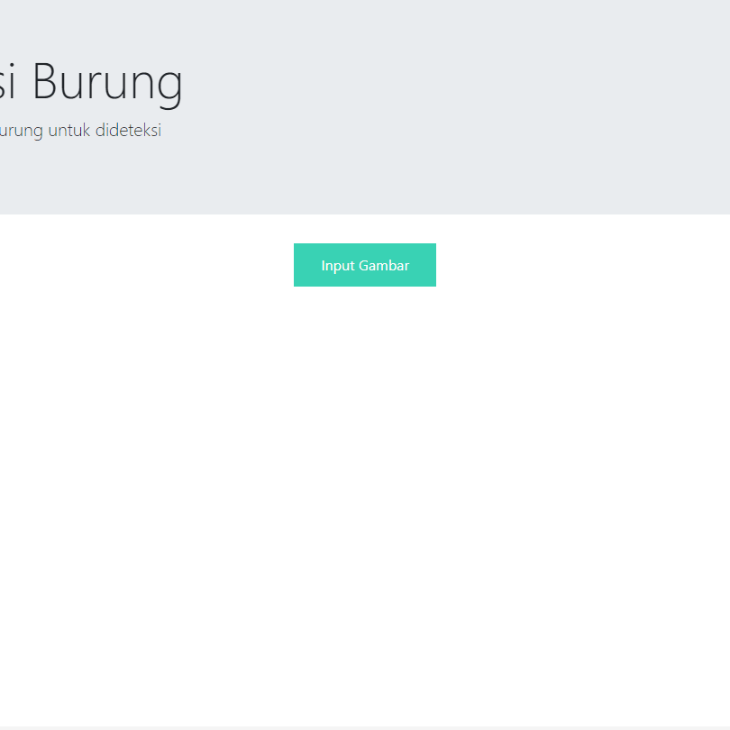

# Deteksi-Jenis-Burung-di-Maluku-Menggunakan-CNN

Deteksi jenis burung di Maluku menggunakan convolutional neural network (CNN) dan flask-security.

## Dataset
The dataset can be accessed from [this link](https://drive.google.com/drive/folders/1TL57pV6rmss0b3Kk94TthWemCZMG58Eq?usp=sharing)

## Model
The pre-trained CNN model can be downloaded from [this link](https://drive.google.com/file/d/1_nWfPl7QctLJWiAyiNcMsn10YC9yikRD/view?usp=sharing)

